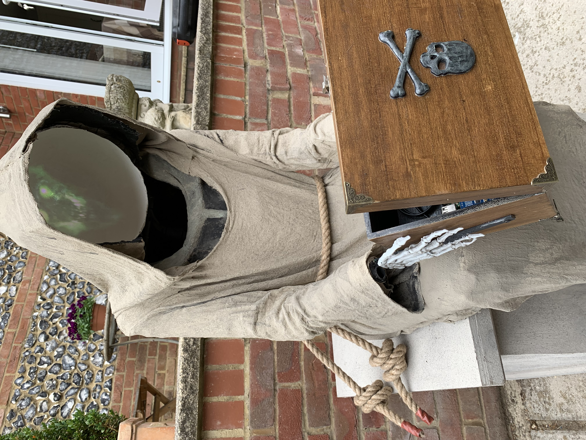

# Halloween Fate of Man

A simple processing application for a statue. The idea is that a RPi 3B+ is inside a wooden box
 along with a pico projector. When a body passes nearby a PIR sensor is triggered. This causes the processing sketch to turn a servo attached to the box lid which opens it. At the same time a
creaking audio track is played.

The box is 'held' by a hollow stone spook. The inside of the head/cowl is actually a projection
surface which the Pico projector plays onto using projection mapping (simple keystone mapping).
A haunted wraith skull movie plays with scary sound. If it is set correctly the projection
on to the inside of the cowl should look like a hollow face illusion.

At the end the box lid closes.

And what is the 'Fate of Man'?   ---- Death of course.

## Video of the finished statue

This is a video of the finished statue. The audio is actually much better in person. There is a large bass speaker in the plinth which can be turned up for the night.

# Build Description

