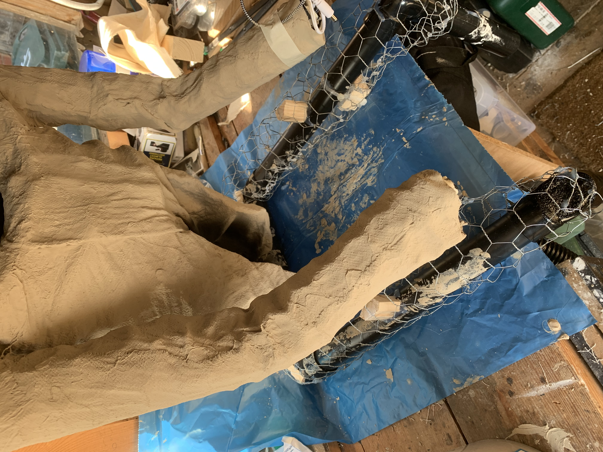

# Halloween Fate of Man

A simple processing application for a statue. The idea is that a RPi 3B+ is inside a wooden box
 along with a pico projector. When a body passes nearby a PIR sensor is triggered. This causes the processing sketch to turn a servo attached to the box lid which opens it. At the same time a
creaking audio track is played.

The box is 'held' by a hollow stone spook. The inside of the head/cowl is actually a projection
surface which the Pico projector plays onto using projection mapping (simple keystone mapping).
A haunted wraith skull movie plays with scary sound. If it is set correctly the projection
on to the inside of the cowl should look like a hollow face illusion.

At the end the box lid closes.

And what is the 'Fate of Man'?   ---- Death of course.

## Video of the finished statue

This is a video of the finished statue. The audio is actually much better in person. There is a large bass speaker in the plinth which can be turned up for the night.

# Build Description
## Electronics and Software
After having the initial about projecting into a hollow-face embedded inside a graveyard statue I had to work out how to physically build it.
Before going into details of the build its worthwhile saying that I created a desktop mockup of all the active components. The software is written in the Processing language and runs on a Raspberry Pi 3B+. The Pi monitors a PIR detector and when it detects movement it triggers a servo conntected to a servo driver hat. Whilst the servo is running a creaking door sound effect plays as the box lid opens. 

The video output from the RPi is fed to a pico projector. Even when displaying no video the projector still emits quite a lot of white light so the projected beam comes through the front of the box and a metal shutter connected to the box lid completely blanks the screen. This keeps the statue face dark until it is actually triggered.

Once the lid is open the RPi plays a scary face video extracted from an AtmosFX sequence. To cater for the irregular position of the box and projector and also for the curved surface the RPi/Processing program also performs projection mapping on the video. This makes it possible to tune the video to fill the whole curved face screen.

At the end the video finishes and the lid closes with more sound effects.

## Projection Screen
I wanted to find a decent hollow-face mask but drew a blank. Instead I resorted to casting one. A ballon was inflated to about the right size. Then plaster of paris bandage was applied on one half to create the surface. Obvisouly the inside of the screen is nice and smooth. A pipe fitting was added to the back and cast into the shape to allow it to fix on my skeleton when built. 

## Box
The wooden box came from a craft shop. 

  
It was drilled for the projection image to come out and a small adjustable platform built to allow the screen height to be changed. 

  
On the other side of the box a hole was made for the PIR sensor.

  
Also inside the box wooden brackets were added to hold the RC servo for the lid opener. 

## Skeleton
With the box completed the skeleton was fabricated from 32mm (1 1/4") PVC waste pipe. Since I planned to monster mud a coating over the whole thing it didn't need to be brilliant. The minimum projection distance set the dimensions of the whole thing. As you can see from the image I also needed to keep the box down and in front of the phantom. The weight of the box (with electronics) meant that I had to fix the box to the front of the statue. Metal rods were fixed to the sides of the box and these were fed up inside the arms and held in place with epoxy putty. Once the putty had dried the box can still be removed for another year.
  

The metal rods would later be covered by plastic skeleton hands which him a bit creepier.

## Skin
To give some bulk to the figure I used chicken wire to create an outer skin layer for the monster mud cloth to sit on. This inner skin layer would later be hidden by an outer cloak but I wanted to practice the mudding technique and this helps bulk him out.
  

In thie next shot you can see the head/screen in place under a chicken wire cowl. The molded screen was sprayed with some clear varnish as I'm not sure how well it will last in the British weather in October. The face was also temporarily covered with plastic sheet for the clothing process.
  

I made the final cloak actually as a piece of clothing. Glueing and stitching arms to it in order to get a reasonable shaped garment. It was then slit at the back to put it on the figure once it was soaked in mud. 
NOTE for British readers, monster mud here was made with 4-5parts drywall jointing compound (Homebase) and 1 part Exterior Emulsion paint. This seems to be called Latex paint in the USA but obviously I had to find the UK equivalent.

Here is the finished head with calibration software running (the grid) which helps when aligning the projection mapping.
  

That's about all I can think of for now. 

# Happy Halloween
